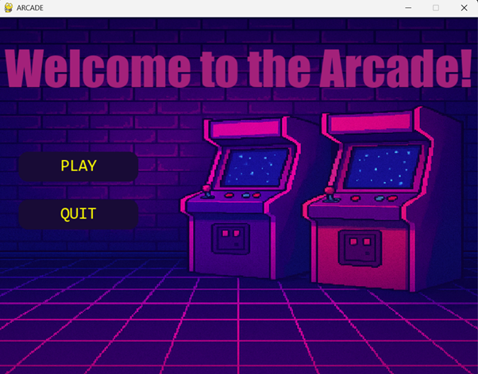
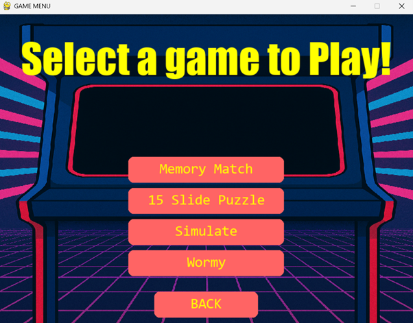
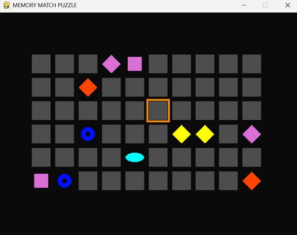
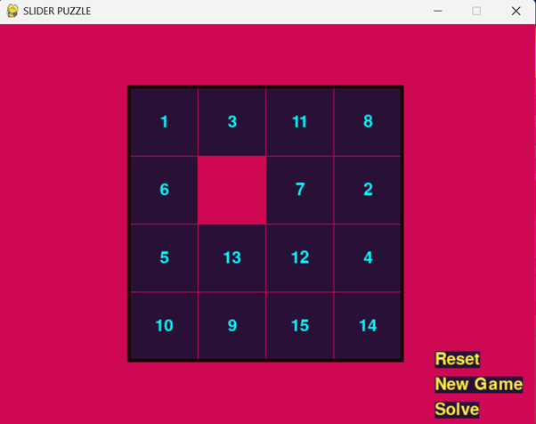
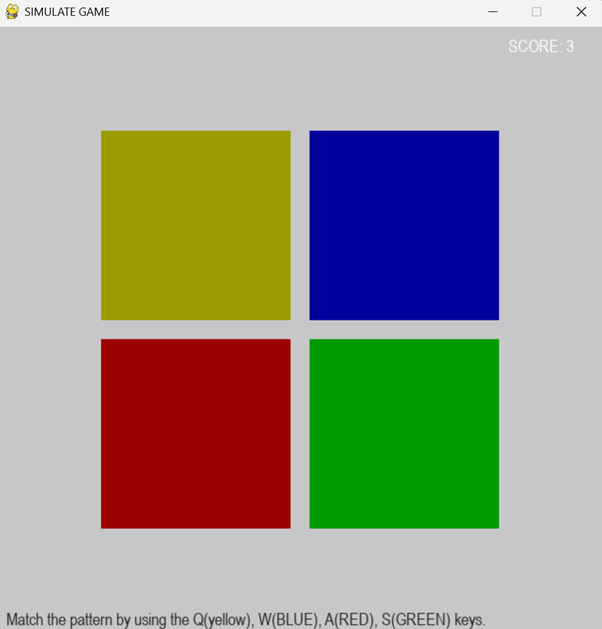
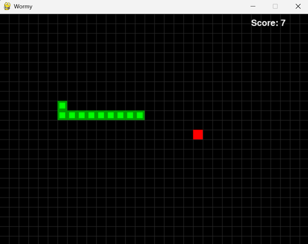

# Arcade

End semester practical project (April '25) for Open Source Programming, showcasing 4 independent old-school arcade games with a neon retro theme built by using PyGame library in python.

Team Members:

- Aditya Punetha
- Anirudh Sangwan
- Agastya Dhand

# Snapshots

